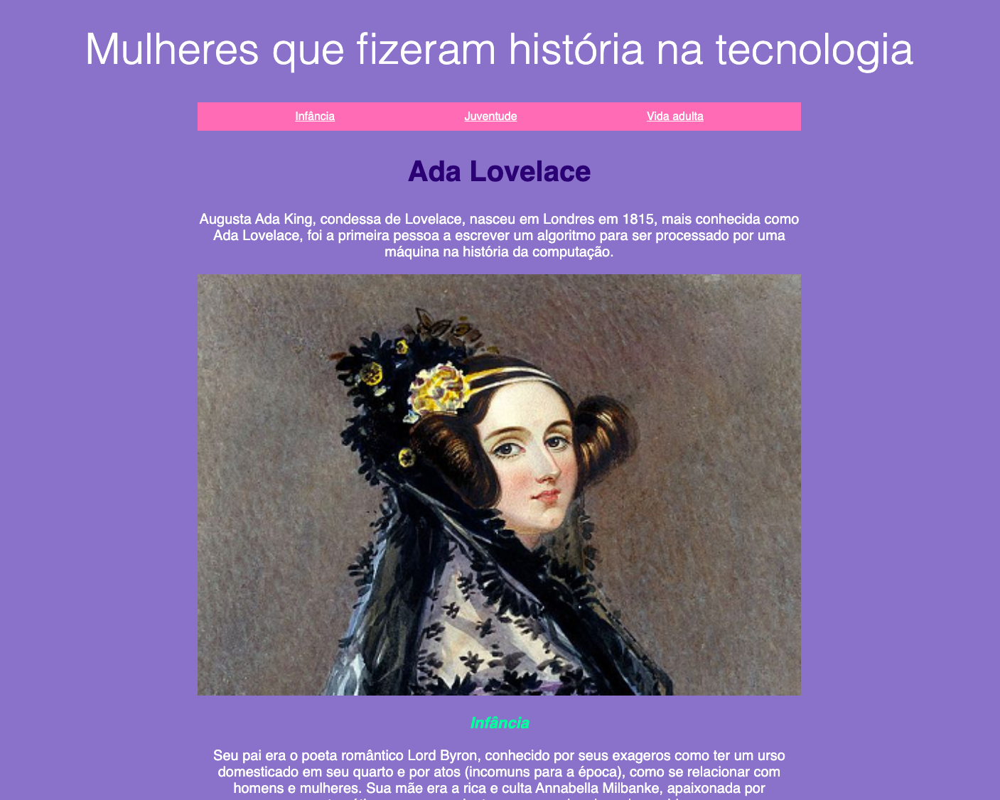
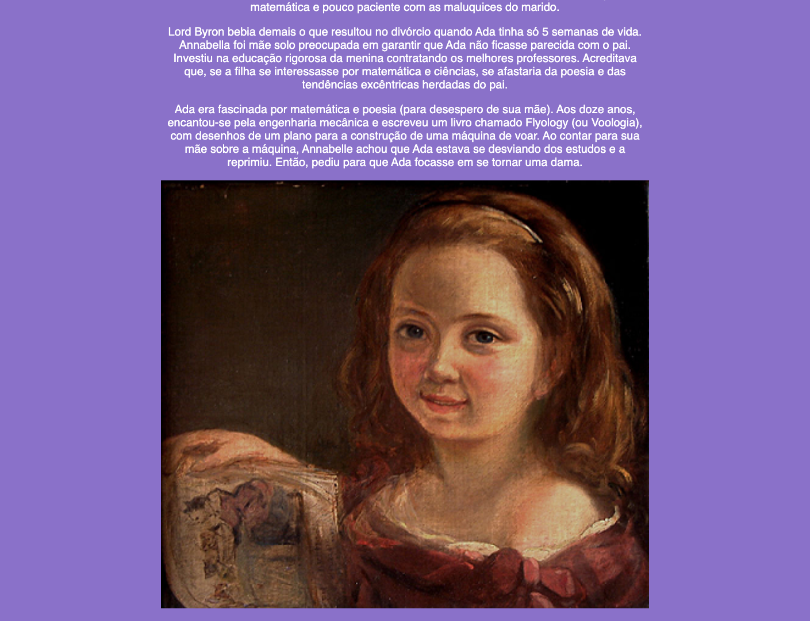
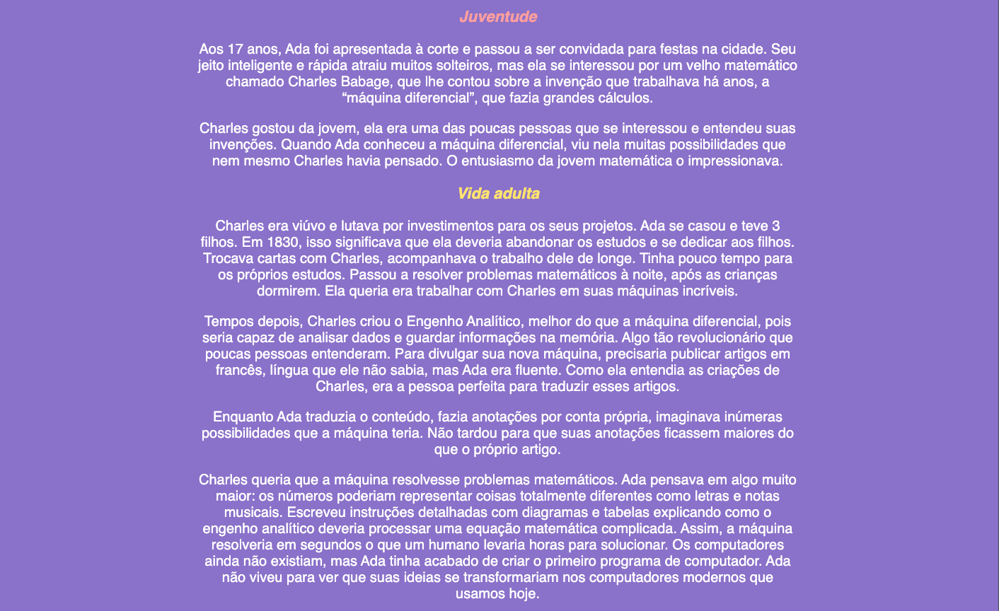
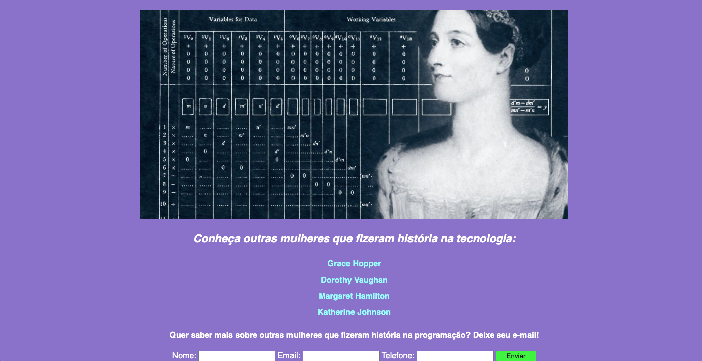

# 📝 Projeto Site [Ada Lovelace](https://pt.wikipedia.org/wiki/Ada_Lovelace) 
## [Ada Lovelace](https://pt.wikipedia.org/wiki/Ada_Lovelace) Website Design

# 👩🏻‍💻 Website about the life of - [Ada Lovelace](https://pt.wikipedia.org/wiki/Ada_Lovelace)

Augusta Ada Byron King, Condessa de Lovelace (nascida Byron, 10 de dezembro de 1815 — 27 de novembro de 1852), atualmente conhecida como Ada Lovelace, foi uma matemática e escritora inglesa. Hoje é reconhecida principalmente por ter escrito o primeiro algoritmo para ser processado por uma máquina, a máquina analítica de Charles Babbage.

Durante o período em que esteve envolvida com o projeto de Babbage, ela desenvolveu os algoritmos que permitiriam à máquina computar os valores de funções matemáticas, além de publicar uma coleção de notas sobre a máquina analítica. Por esse trabalho é considerada a primeira programadora de toda a história.

# 🛠 Technologies 

This project was developed with the following technologies:

PT-BR: Esse projeto foi desenvolvido com as seguintes tecnologias: 

- [HTML](##HTML)
- [CSS](##CSS)
- [JavaScript](##JavaScript)
- [Replit](##https://replit.com/@BiancaMos/siteada-1#index.html)

# 🚀 Project

Project made in [Progra{m}aria](https://www.programaria.org/) in course online "I Program"

PT-BR: Projeto feito no curso [Progra{m}aria](https://www.programaria.org/) "Eu Progr{amo}" 

- **[Online project](https://siteada-1.biancamos.repl.co/)**

# 
                    Feito com 💜 by BM

###### 🗓 Conclusão do Curso [Progra{m}aria](https://www.programaria.org/) em: 20/05/2021 
